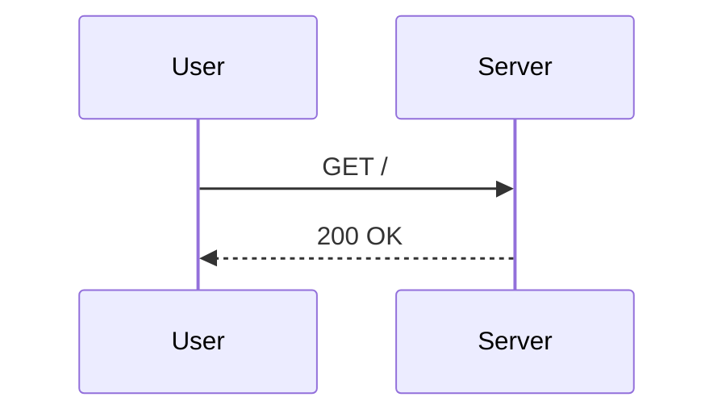

# Markdown reference for PaperNotes cards

Every snippet below is valid markdown for the `Front` or `Back` field. The React bundle
parses it at card-flip time, so what you store is what you see.

---

## Plain prose, with emphasis

```
**快速排序**的最坏时间复杂度是 *O(n²)*。
```

## Bullet / ordered lists

```
- 平均：O(n log n)
- 最坏：O(n²)
- 空间：O(log n) 递归栈
```

```
1. 选 pivot
2. partition
3. 递归两侧
```

## Tables (GFM)

```
| 算法 | 平均 | 最坏 | 稳定 |
|---|---|---|---|
| 快排 | O(n log n) | O(n²) | 否 |
| 归并 | O(n log n) | O(n log n) | 是 |
```

## Inline code & fenced code (collapsible if >12 lines)

```
内联：使用 `Array.prototype.sort` 即可。
```

````
```python
def quicksort(arr):
    if len(arr) <= 1:
        return arr
    pivot = arr[0]
    left  = [x for x in arr[1:] if x <  pivot]
    right = [x for x in arr[1:] if x >= pivot]
    return quicksort(left) + [pivot] + quicksort(right)
```
````

Languages with built-in highlighting: `bash`, `c`, `cpp`, `css`, `go`, `html`,
`java`, `javascript`/`js`, `json`, `markdown`/`md`, `python`/`py`, `rust`/`rs`,
`shell`/`sh`, `sql`, `typescript`/`ts`/`tsx`, `xml`, `yaml`/`yml`.

## Math (KaTeX)

```
分治递推：$T(n) = 2T(n/2) + O(n) = O(n \log n)$。

$$
\sum_{k=1}^{n} k = \frac{n(n+1)}{2}
$$
```

## Mermaid (flowchart / sequence / class / state / ER / gantt …)

````
```mermaid
flowchart LR
  A[输入数组] --> B{选 pivot}
  B -->|总是最值| C[最坏 O(n²)]
  B -->|随机| D[期望 O(n log n)]
```
````

````

````

## Image (from Anki media folder)

```

```

The filename must already exist in `~/Library/Application Support/Anki2/<profile>/collection.media/`.
The skill writes such files via `mcp__ankimcp__storeMediaFile` before adding the note.

## Blockquote

```
> 快速排序的精髓是分治：如果你能把规模减半，O(n log n) 几乎是免费的。
```

## Links (open in default browser)

```
参见 [Sedgewick 1980](https://www.cs.princeton.edu/~rs/talks/QuicksortIsOptimal.pdf)。
```
